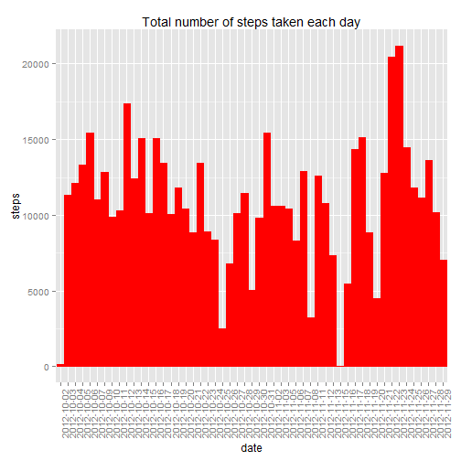
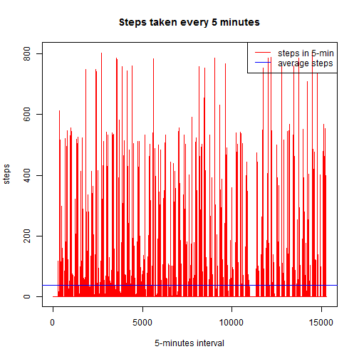
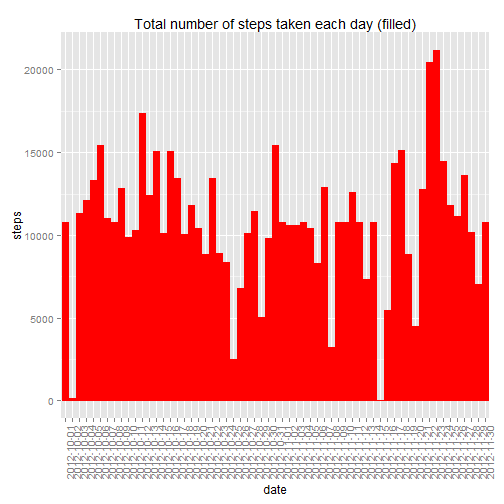
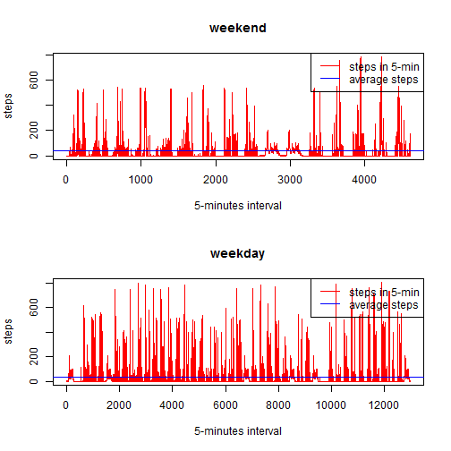

# Reproducible Research: Peer Assessment 1
This assignment has to analysis a personal activity monitoring device data to answer
a number of questions.  

## Loading and preprocessing the data
First of all, I read in the data file and create a new data frame filtered out all rows with *NA* values.  As the interval repeats every day, a new field *seq* is created for plot against the interval.  


```r
data <- read.csv("activity.csv", na.strings = "NA")
data_x_na <- data[!is.na(data$steps),]
data_x_na$seq <- seq_along(data_x_na$date)
```
 

## What is mean total number of steps taken per day?


Create a new dataset with date and the total steps for each day  


```r
daily_steps <- aggregate(data_x_na$steps, by=list(data_x_na$date), sum)
colnames(daily_steps) <- c("date", "steps")
```

**1.** Plot the total steps for each day:  


```r
library(ggplot2)
ggplot(daily_steps, aes(date, steps)) + geom_histogram(colour = "red", fill = "red") + opts(axis.text.x = element_text(angle = 90)) + ggtitle("Total number of steps taken each day")
```

```
## 'opts' is deprecated. Use 'theme' instead. (Deprecated; last used in version 0.9.1)
## Mapping a variable to y and also using stat="bin".
##   With stat="bin", it will attempt to set the y value to the count of cases in each group.
##   This can result in unexpected behavior and will not be allowed in a future version of ggplot2.
##   If you want y to represent counts of cases, use stat="bin" and don't map a variable to y.
##   If you want y to represent values in the data, use stat="identity".
##   See ?geom_bar for examples. (Deprecated; last used in version 0.9.2)
```

 

**2.** Use the following code to calculate mean and median of the steps taken per day:  


```r
step_mean <- mean(daily_steps$steps)
step_median <- median(daily_steps$steps)
```


**Result:**  

The mean of total number of steps taken per day is: *1.0766 &times; 10<sup>4</sup>*  
The median of total number of steps taken per day is: *10765*    


## What is the average daily activity pattern?


**1.** Here we plot a time series plot of the 5-miniute interval and the average number of steps taken within each 5-minute interval across all days.  


```r
with(data_x_na, plot(seq, steps, type = "l", col = "red", main = "Steps taken every 5 minutes", xlab = "5-minutes interval"))
abline(h=mean(data_x_na$steps), col = "blue")
legend("topright", legend=c("steps in 5-min", "average steps"), col = c("Red", "Blue"),lty = 1)
```

 

**2.** To find which 5-minute interval on average acroos all days contains the maximum number of steps, I created a new dataset using the aggregate() function on the intervals across all days with mean() on the number of steps.  Then the interval with highest average number of step is stored in the max_interval variable.


```r
interval_average <- aggregate(data_x_na$steps, by = list(data_x_na$interval), mean)
colnames(interval_average) <- c("interval", "average.steps")
max_interval <- interval_average[which.max(interval_average$average.steps),"interval"]
max_hr <- max_interval %/% 100
max_min <- max_interval - max_hr * 100
```

**Result:**  

The interval contains the maximum number of steps is at the *8* hour and *35* minute.    


## Imputing missing values

There are a number of days' intervals where there are missing values.  

**1.** Calculate and report the total number of missing values in the dataset  


```r
num_na <- nrow(data[is.na(data$steps),])
percent_na <- num_na / nrow(data) * 100
```

The number of rows with NA values is: *2304* and it is about *13.1148%* of the dataset

**2.** We will refilling all missing values using the mean of that 5-minute interval.  

**3.** Code below will create a new data frame with all missing data filled in using the strategy described in **2.**  


```r
data_filled <- data
data_filled$seq <- seq_along(data_filled$date)
for (i in seq_along(data_filled$steps)) {
    if (is.na(data_filled[i,1])) {
        data_filled[i,1] <- interval_average[which(interval_average$interval == data_filled[i,"interval"]), "average.steps"]
    }
}
```

**4.** We will re-run the previous examination on the new filled dataset to see the changes.  


```r
daily_steps2 <- aggregate(data_filled$steps, by=list(data_filled$date), sum)
colnames(daily_steps2) <- c("date", "steps")
```

Plot the total steps for each day on the new data:  


```r
ggplot(daily_steps2, aes(date, steps)) + geom_histogram(colour = "red", fill = "red") + opts(axis.text.x = element_text(angle = 90)) + ggtitle("Total number of steps taken each day (filled)")
```

```
## 'opts' is deprecated. Use 'theme' instead. (Deprecated; last used in version 0.9.1)
## Mapping a variable to y and also using stat="bin".
##   With stat="bin", it will attempt to set the y value to the count of cases in each group.
##   This can result in unexpected behavior and will not be allowed in a future version of ggplot2.
##   If you want y to represent counts of cases, use stat="bin" and don't map a variable to y.
##   If you want y to represent values in the data, use stat="identity".
##   See ?geom_bar for examples. (Deprecated; last used in version 0.9.2)
```

 

Calculate new mean and median of the steps taken per day:  


```r
step_mean2 <- mean(daily_steps2$steps)
step_median2 <- median(daily_steps2$steps)
```

The new mean of total number of steps taken per day is: *1.0766 &times; 10<sup>4</sup>*  
The new median of total number of steps taken per day is: *1.0766 &times; 10<sup>4</sup>*  


**Conclusion**  

*The results we observed from the new dataset (with all missing values filled) show minimal difference in compare to our first attend when all missing values are just ignored.*  


## Are there differences in activity patterns between weekdays and weekends?


**1.** Create a new factor variable in teh dataset with two levels - "weekday" and "weekend"  


```r
weekdays <- c("Monday", "Tuesday", "Wednesday", "Thursday", "Friday")
data_filled$date <- as.Date(data_filled$date)
for (i in seq_along(data_filled$steps)) {
    if (weekdays(data_filled[i,2]) %in% weekdays) {
        data_filled[i,5] <- "weekday"
    }
    else {
        data_filled[i,5] <- "weekend"
    }
}
colnames(data_filled) <- c("steps", "date", "interval", "seq", "day")
data_filled$day <- as.factor(data_filled$day)
```

**2.** Make a panel plot containing a time series plot of the 5-minute interval and average number of steps taken across all weekday or weekend days.


```r
data_weekday = subset(data_filled, day == "weekday")
data_weekday$seq <- seq_along(data_weekday$date)
data_weekend = subset(data_filled, day == "weekend")
data_weekend$seq <- seq_along(data_weekend$date)

weekend_daily <- aggregate(data_weekend$steps, by=list(data_weekend$date), sum)
colnames(weekend_daily) <- c("date", "steps")

weekday_daily <- aggregate(data_weekday$steps, by=list(data_weekday$date), sum)
colnames(weekday_daily) <- c("date", "steps")

weekend_average <- mean(weekend_daily$steps)
weekday_average <- mean(weekday_daily$steps)

par(mfcol=c(2,1))

with(data_weekend, plot(seq, steps, type = "l", col = "red", main = "weekend", xlab = "5-minutes interval"))
abline(h=mean(data_weekend$steps), col = "blue")
legend("topright", legend=c("steps in 5-min", "average steps"), col = c("Red", "Blue"),lty = 1)

with(data_weekday, plot(seq, steps, type = "l", col = "red", main = "weekday", xlab = "5-minutes interval"))
abline(h=mean(data_weekday$steps), col = "blue")
legend("topright", legend=c("steps in 5-min", "average steps"), col = c("Red", "Blue"),lty = 1)
```

 

For the final comparison:  

The average number of steps taken daily across all weekends is: *1.2202 &times; 10<sup>4</sup>*  
The average number of steps taken daily across all weekdays is: *1.0256 &times; 10<sup>4</sup>*  

It seems we walk much more during weekends than during weekdays.
